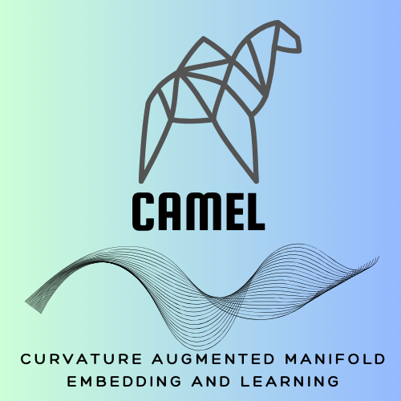

.. -*- mode: rst -*-

|pypi_version|_ |pypi_downloads|_

.. |pypi_version| image:: https://img.shields.io/pypi/v/camel-learn.svg
.. _pypi_version: https://pypi.python.org/pypi/camel-learn/

.. |pypi_downloads| image:: https://pepy.tech/badge/camel-learn/month
.. _pypi_downloads: https://pepy.tech/project/camel-learn

Curvature Augmented Manifold Embedding and Learning -- CAMEL
=======================================

CAMEL (/CAMEL-Learn/) is a Python tool for dimension reduction and data visualization. CAMEL can perform unsupervised learning, supervised learning, semi-supervised learning, metric learning, and inverse learning! CAMEL offers a simple and intuitive API.

========================================

Install:

pip install camel-learn

==========================================

Simple code examples in test folder: (more coming)

