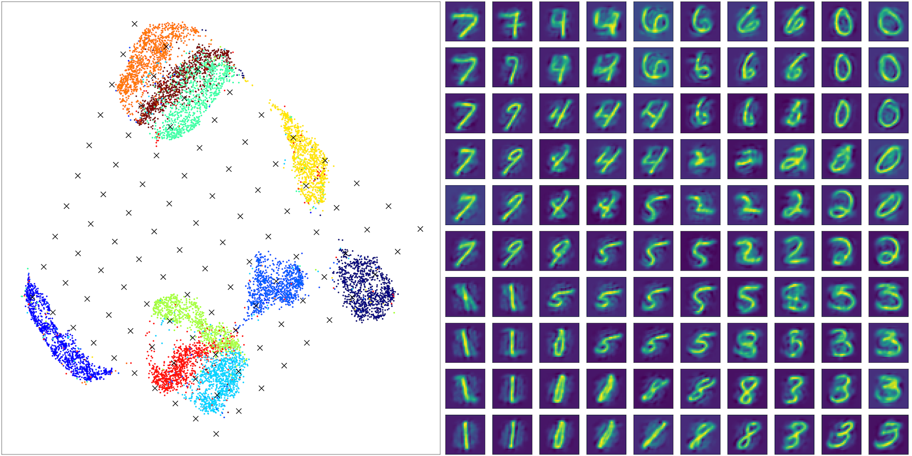
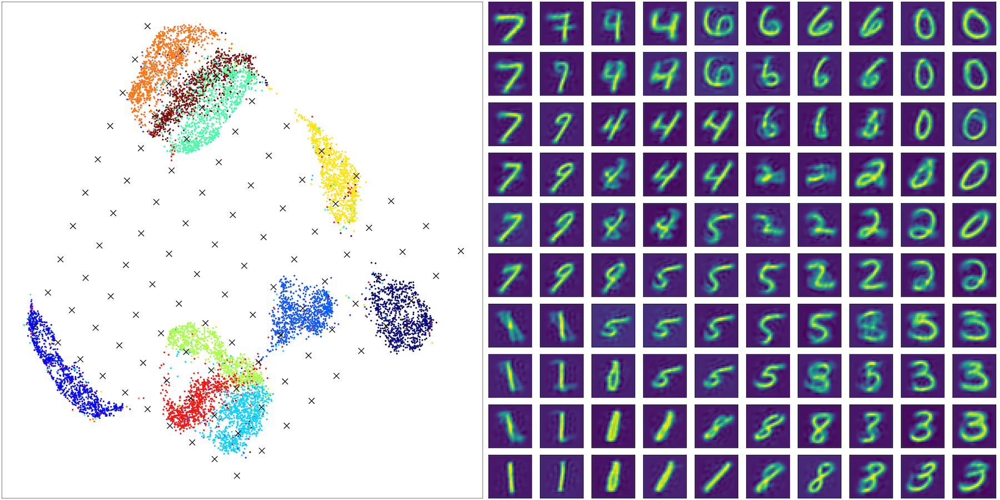

Inverse Learning
======================

Inverse Learning operation is a unique operation of CAMEL. It calls the fit_transform and inverse_transform function of CAMEL(). The key idea is to use the training data and fit_transform to project the original high-dim data to a low-dim space. A random (or non-random) samples in the low-dim will be projected back to the high-dim using the inverse operation.

We will use two examples below with code to illustrate how to use CAMEL to perform the supervised learning task.

Case I: MNIST
-----------------------

A comprehensive exmaple is shown here for MNIST data, which is the template (inverse_learning_compare.py) under the folder demo in the git repo. Dpemneding on your stored location, the path in the code might need to be updated.

The example is very similar to the unsupervised learning example and is not repeated here.

.. code:: python
        ........
            data_path = "../data/"
            output_path = "../output/inverse_learning/"

            methods_compare= ['CAMEL']
            data_compare = ['MNIST']

            X, y = data_prep(data_path, data_compare[0], size=10000)
                
            if len(set(y))>0.1*y.shape[0]:
                labels_contineous=True
                target_type='numerical'
                target_metric='l2'
            else:
                labels_contineous=False
                target_type='categorical'
                target_metric='categorical'
                        
                        
            reducer= CAMEL(target_type=target_type, random_state=1)

            X_embedding = reducer.fit_transform(X)
            y = y.astype(int)

            #Xnewdata=X[1:X.shape[0],:]
            #X_transformed = reducer.transform(Xnew,basis=X)

            plt.figure(figsize=(6,6),layout='constrained',dpi=300)
            plt.scatter(X_embedding[:, 0], X_embedding[:, 1], c=y, cmap='jet', s=0.2)
            plt.title('CAMEL Embedding')

            plt.tight_layout()
            plt.show()

The above code performs the unsupervised learning using MNIST data. A figure will shown as

Now, you can setup a grid to cover the embedding envelope and to generate samples in the low-dim space.

.. code:: python

        corners = np.array([
            [-8, 15],  # top left corner
            [+20, 0.0], #top right corner
            [-18, -5],  # bottom left corner
            [+0, -15],  # bottom right
        ])

        test_pts = np.array([
            (corners[0]*(1-x) + corners[1]*x)*(1-y) +
            (corners[2]*(1-x) + corners[3]*x)*y
            for y in np.linspace(0, 1, 10)
            for x in np.linspace(0, 1, 10)
        ])

Once the grid samples are obtained, we can perform the inverse projection of these sampels to the original image sapce and plot them.

.. code:: python

        X_embedding_inverse = reducer.inverse_transform(test_pts, init='random')

        # Set up the grid
        fig = plt.figure(figsize=(24,12),layout='constrained',dpi=300)
        gs = GridSpec(10, 20, fig)
        scatter_ax = fig.add_subplot(gs[:, :10])
        digit_axes = np.zeros((10, 10), dtype=object)
        for i in range(10):
            for j in range(10):
                digit_axes[i, j] = fig.add_subplot(gs[i, 10 + j])

        # Use umap.plot to plot to the major axis
        # umap.plot.points(mapper, labels=labels, ax=scatter_ax)
        scatter_ax.scatter(X_embedding[:, 0], X_embedding[:, 1],
                            c=y, cmap='jet', s=5)
        scatter_ax.set(xticks=[], yticks=[])

        # Plot the locations of the text points
        scatter_ax.scatter(test_pts[:, 0], test_pts[:, 1], marker='x', c='k', s=100)

        # Plot each of the generated digit images
        for i in range(10):
            for j in range(10):
                digit_axes[i, j].imshow(X_embedding_inverse[i*10 + j].reshape(28, 28))
                digit_axes[i, j].set(xticks=[], yticks=[])
                
                
                
        plt.savefig(output_path +'camel_inverse_learning_MNIST_random.png')

The above code performs the visulization of the grid sampling and inverse projected images. 

The left figure is the generated samples (black cross) on top of the embedding. The right is the corresponding generated images. As can be seen, the generated pictures represent the topological variation of the underlying digits. It is noticed that the image are somewhat blurred, as the initial condition is set as random.

If the initial inverse_learning is set to the "interpolate", where the initial images are set as the average values of all neighbors, a new generation can be performed.

.. code:: python

        X_embedding_inverse = reducer.inverse_transform(test_pts, init='interpolate')

        # Set up the grid
        fig = plt.figure(figsize=(24,12),layout='constrained',dpi=300)
        gs = GridSpec(10, 20, fig)
        scatter_ax = fig.add_subplot(gs[:, :10])
        digit_axes = np.zeros((10, 10), dtype=object)
        for i in range(10):
            for j in range(10):
                digit_axes[i, j] = fig.add_subplot(gs[i, 10 + j])

        # Use umap.plot to plot to the major axis
        # umap.plot.points(mapper, labels=labels, ax=scatter_ax)
        scatter_ax.scatter(X_embedding[:, 0], X_embedding[:, 1],
                            c=y, cmap='jet', s=5)
        scatter_ax.set(xticks=[], yticks=[])

        # Plot the locations of the text points
        scatter_ax.scatter(test_pts[:, 0], test_pts[:, 1], marker='x', c='k', s=100)

        # Plot each of the generated digit images
        for i in range(10):
            for j in range(10):
                digit_axes[i, j].imshow(X_embedding_inverse[i*10 + j].reshape(28, 28))
                digit_axes[i, j].set(xticks=[], yticks=[])
                
                
                
        plt.savefig(output_path +'camel_inverse_learning_MNIST_interpolate.png')    

It is shown that, irrespective of the initial conditions, the final generated images have the similar patterns, with much clearer boundaries if interpolate rather than random is used. 

Case II: FMNIST
-----------------------

The second example is for the FMNIST data set. It is known that pure unsupervised learning is hard to have a good clustering behavior. Thus, inverse projection of the low-dim samples will have ambuiguities. 

This example illustrate that how to use label information and supervised learning to enhance the generative power.

.. code:: python
        ........
        methods_compare= ['CAMEL']
        data_compare = ['FMNIST']

        X, y = data_prep(data_path, data_compare[0], size=10000)

        if len(set(y))>0.1*y.shape[0]:
            labels_contineous=True
            target_type='numerical'
            target_metric='l2'
        else:
            labels_contineous=False
            target_type='categorical'
            target_metric='categorical'

        reducer= CAMEL(target_type=target_type, random_state=1)

        X_embedding = reducer.fit_transform(X)
        y = y.astype(int)

        #Xnewdata=X[1:X.shape[0],:]
        #X_transformed = reducer.transform(Xnew,basis=X)

        plt.figure(figsize=(6,6),layout='constrained',dpi=300)
        plt.scatter(X_embedding[:, 0], X_embedding[:, 1], c=y, cmap='jet', s=0.2)
        plt.title('CAMEL Embedding')

        plt.tight_layout()
        plt.show()

The above code performs the unsupervised learning using FMNIST data. A figure will shown as

As expected, no clear clustering and seperation can be seen using the unsupervised learning. Now, you can setup a grid to cover the embedding envelope and to generate samples in the low-dim space.

.. code:: python

        corners = np.array([
            [-15, 15],  # top left corner
            [+10, 5], #top right corner
            [-15, 0],  # bottom left corner
            [+0, -15],  # bottom right
        ])

        test_pts = np.array([
            (corners[0]*(1-x) + corners[1]*x)*(1-y) +
            (corners[2]*(1-x) + corners[3]*x)*y
            for y in np.linspace(0, 1, 10)
            for x in np.linspace(0, 1, 10)
        ])

        # X_embedding_inverse = reducer.inverse_transform(test_pts)
        X_embedding_inverse = reducer.inverse_transform(test_pts)

        # Set up the grid
        fig = plt.figure(figsize=(24,12),layout='constrained',dpi=300)
        gs = GridSpec(10, 20, fig)
        scatter_ax = fig.add_subplot(gs[:, :10])
        digit_axes = np.zeros((10, 10), dtype=object)
        for i in range(10):
            for j in range(10):
                digit_axes[i, j] = fig.add_subplot(gs[i, 10 + j])

        # Use umap.plot to plot to the major axis
        # umap.plot.points(mapper, labels=labels, ax=scatter_ax)
        scatter_ax.scatter(X_embedding[:, 0], X_embedding[:, 1],
                            c=y, cmap='jet', s=5)
        scatter_ax.set(xticks=[], yticks=[])

        # Plot the locations of the text points
        scatter_ax.scatter(test_pts[:, 0], test_pts[:, 1], marker='x', c='k', s=100)

        # Plot each of the generated digit images
        for i in range(10):
            for j in range(10):
                digit_axes[i, j].imshow(X_embedding_inverse[i*10 + j].reshape(28, 28))
                digit_axes[i, j].set(xticks=[], yticks=[])

        plt.savefig(output_path +'camel_inverse_learning_FMNIST_unsuper.png')

We can observe some generative power of the inverse projection. However, if the low-dim is not well-seperated, the generated images will be hard to interpret. For example, the rows 5-6 in the right most column correpond to the black cross of the overlap region in the low-dim embedding.

Thus, the generated images are somewhat mixed charcateristics of several class and cannot be easily interprected. If the clustering can be enhanced by labels, the generated images should be much more clear.

.. code:: python

        methods_compare= ['CAMEL']
        data_compare = ['FMNIST']

        X, y = data_prep(data_path, data_compare[0], size=10000)

        if len(set(y))>0.1*y.shape[0]:
            labels_contineous=True
            target_type='numerical'
            target_metric='l2'
        else:
            labels_contineous=False
            target_type='categorical'
            target_metric='categorical'

        reducer= CAMEL(target_type=target_type, random_state=1)

        X_embedding = reducer.fit_transform(X, y)
        y = y.astype(int)

        #Xnewdata=X[1:X.shape[0],:]
        #X_transformed = reducer.transform(Xnew,basis=X)

        plt.figure(figsize=(6,6),layout='constrained',dpi=300)
        plt.scatter(X_embedding[:, 0], X_embedding[:, 1], c=y, cmap='jet', s=0.2)
        plt.title('CAMEL Embedding')

        plt.tight_layout()
        plt.show()

        corners = np.array([
            [-15, 20],  # top left corner
            [+15, 20], #top right corner
            [-15, -20],  # bottom left corner
            [+15, -20],  # bottom right
        ])

        test_pts = np.array([
            (corners[0]*(1-x) + corners[1]*x)*(1-y) +
            (corners[2]*(1-x) + corners[3]*x)*y
            for y in np.linspace(0, 1, 10)
            for x in np.linspace(0, 1, 10)
        ])

        # X_embedding_inverse = reducer.inverse_transform(test_pts)
        X_embedding_inverse = reducer.inverse_transform(test_pts)

        # Set up the grid
        fig = plt.figure(figsize=(24,12),layout='constrained',dpi=300)
        gs = GridSpec(10, 20, fig)
        scatter_ax = fig.add_subplot(gs[:, :10])
        digit_axes = np.zeros((10, 10), dtype=object)
        for i in range(10):
            for j in range(10):
                digit_axes[i, j] = fig.add_subplot(gs[i, 10 + j])

        # Use umap.plot to plot to the major axis
        # umap.plot.points(mapper, labels=labels, ax=scatter_ax)
        scatter_ax.scatter(X_embedding[:, 0], X_embedding[:, 1],
                            c=y, cmap='jet', s=5)
        scatter_ax.set(xticks=[], yticks=[])

        # Plot the locations of the text points
        scatter_ax.scatter(test_pts[:, 0], test_pts[:, 1], marker='x', c='k', s=100)

        # Plot each of the generated digit images
        for i in range(10):
            for j in range(10):
                digit_axes[i, j].imshow(X_embedding_inverse[i*10 + j].reshape(28, 28))
                digit_axes[i, j].set(xticks=[], yticks=[])

        plt.savefig(output_path +'camel_inverse_learning_FMNIST.png')

The above code performs the supervised learning and the well-seperated clusters can be observed. Whwen the inverse generation is performed with this embedding, a much more clear and interpretable images are onbatained. 

  .. image:: ../camel_inverse_learning_FMNIST.png
  :width: 600
  :alt: supervised_model_compare
  :align: center

It is also interesting to see some truely generative power. All images corresponding to the four cornners are samples never seen in the training set.

A comparative study is performed with UMAP. A supervised learning using UMAP can be done for the FMNIST dataset as

.. code:: python

        methods_compare= ['UMAP']
        data_compare = ['FMNIST']

        X, y = data_prep(data_path, data_compare[0], size=10000)
                
        if len(set(y))>0.1*y.shape[0]:
            labels_contineous=True
            target_type='numerical'
            target_metric='l2'
        else:
            labels_contineous=False
            target_type='categorical'
            target_metric='categorical'
                    
                    
        reducer= umap.UMAP(target_metric=target_metric, random_state=1)

        X_embedding = reducer.fit_transform(X, y)
        y = y.astype(int)

        #Xnewdata=X[1:X.shape[0],:]
        #X_transformed = reducer.transform(Xnew,basis=X)

        plt.figure(figsize=(6,6),layout='constrained',dpi=300)
        plt.scatter(X_embedding[:, 0], X_embedding[:, 1], c=y, cmap='jet', s=0.2)
        plt.title('CAMEL Embedding')

        plt.tight_layout()
        plt.show()

A figure for embedding using UMAP can be seen and it is observed that the UMAP can also have a well-seperated clusters with a more compact with-in cluster structure.

We can perform the similar grid sampling and inverse projection using UMAP as

.. code:: python

        corners = np.array([
            [-15, 20],  # top left corner
            [+30, 20], #top right corner
            [-15, -10],  # bottom left corner
            [+30, -10],  # bottom right
        ])

        test_pts = np.array([
            (corners[0]*(1-x) + corners[1]*x)*(1-y) +
            (corners[2]*(1-x) + corners[3]*x)*y
            for y in np.linspace(0, 1, 10)
            for x in np.linspace(0, 1, 10)
        ])

        # X_embedding_inverse = reducer.inverse_transform(test_pts)
        X_embedding_inverse = reducer.inverse_transform(test_pts)

        # Set up the grid
        fig = plt.figure(figsize=(24,12),layout='constrained',dpi=300)
        gs = GridSpec(10, 20, fig)
        scatter_ax = fig.add_subplot(gs[:, :10])
        digit_axes = np.zeros((10, 10), dtype=object)
        for i in range(10):
            for j in range(10):
                digit_axes[i, j] = fig.add_subplot(gs[i, 10 + j])

        # Use umap.plot to plot to the major axis
        # umap.plot.points(mapper, labels=labels, ax=scatter_ax)
        scatter_ax.scatter(X_embedding[:, 0], X_embedding[:, 1],
                            c=y, cmap='jet', s=5)
        scatter_ax.set(xticks=[], yticks=[])

        # Plot the locations of the text points
        scatter_ax.scatter(test_pts[:, 0], test_pts[:, 1], marker='x', c='k', s=100)

        # Plot each of the generated digit images
        for i in range(10):
            for j in range(10):
                digit_axes[i, j].imshow(X_embedding_inverse[i*10 + j].reshape(28, 28))
                digit_axes[i, j].set(xticks=[], yticks=[])
                
                
                
        plt.savefig(output_path +'umap_inverse_learning_FMNIST.png')

One can observe that UMAP also shows some general variation of the classes, but with very blurred boundaries and lost many details as those seen in the CAMEL generation.