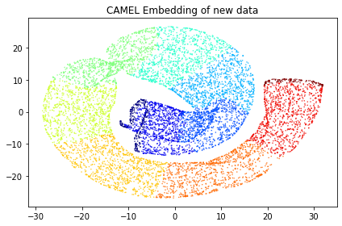

Metric Learning
======================

Metric Learning operation is a unique operation of CAMEL. It calls the fit_transform and transform function of CAMEL(). The key idea is to use the training data and fit_transform to learn a metric mapping (either unsupervised, supervised, or semi-supervised). Then, transform is used to project new testing data using the learned metric mapping.

We will use several examples below with code to illustrate how to use CAMEL to perform the supervised learning task.

Simple case
------------
One simple example template is available in the git_folder_structure under folder test (test_camel_metric.py).

The first step is to import all nessary modulues, such as 

.. code-block:: python

    import matplotlib.pyplot as plt
    import time
    from camel import CAMEL
    from sklearn import datasets

The next step is to load the data. We also checked the time() function here to evaluae the speed of computing. In this simple example, we directly used the datasets from sklearn package, swiss_roll.

.. code-block:: python

    t1=time.time()

    X, y = datasets.make_swiss_roll(n_samples=50000, random_state=None)
    Xnew, ynew = datasets.make_swiss_roll(n_samples=10000, random_state=None)

Now, we load the feature data to variable X and label info to variable y. 50000 data are loaded. These are training data. We also generate 10000 new testing data (Xnew and ynew). random_state is not fixed, so you will get slightly diffrent results every time you run this data loader.

Following this, we can define the CAMEL() class.

.. code:: python

    reducer= CAMEL(target_type='numerical') #as labels are numerical values 

Now, we define a simplest CAMEL() class, reducer. Next, we want to perform the metric learning using the defined CAMEL() class. 

.. code:: python

    X_embedding = reducer.fit_transform(X)

    X_transformed = reducer.transform(Xnew)
    print(time.time()-t1)

It is seen that the metric learning involves two steps: fit_transform using training data (X) and transform using the testing data (Xnew) 

.. code:: python

    y = y.astype(int)
    ynew=ynew.astype(int)

    #y_transformed = y[1:y.shape[0]]

    # Visualization

    plt.figure(1)
    plt.scatter(X_embedding[:, 0], X_embedding[:, 1], c=y, cmap='jet', s=0.2)
    plt.title('CAMEL Embedding of training data')

    plt.tight_layout()
    plt.show()

    plt.figure(2)
    plt.scatter(X_transformed[:, 0], X_transformed[:, 1], c=ynew, cmap='jet', s=0.2)
    plt.title('CAMEL Embedding of new data')

    plt.tight_layout()
    plt.show()

.. image:: ../swiss_roll_metric_training.png
  :width: 600
  :alt: swiss_roll_unsupervised
  :align: center

You will see the resulted embedding for both training and testing data. It is shown that the projection of new data follows the same metric mapping of the training data. 

Comprehensive example
-----------------------

A more comprehensive exmaple is shown here, which is the template (metric_learning_compare.py) under the folder demo in the git repo. Dpemneding on your stored location, the path in the code might need to be updated.

The example is very similar to the unsupervised learning example and the only differencet step is for the transform operation as

.. code:: python
        ........
       for j in range(n_newdata_ratio):
            
            X_new=np.copy(X_total[10000:int(10000*(1+newdata_ratio[j]))])
            y_new=np.copy(y_total[10000:int(10000*(1+newdata_ratio[j]))])
            if methods_compare[k] == 'PaCMAP':

                X_transformed = transformer.transform(X_new, basis=X)                
            elif methods_compare[k]  == 'UMAP':

                X_transformed = transformer.transform(X_new)
 
            elif methods_compare[k] == 'TSNE':
                transformer = TSNE()
            elif methods_compare[k]  == 'TriMAP':
                transformer = trimap.TRIMAP()
            elif methods_compare[k]  == 'CAMEL':

                X_transformed = transformer.transform(X_new, basis=X)

            else:
                print("Incorrect method specified")
                assert(False)

The above code specifies the transform operation with different amount of new data. 

.. code:: python

            # Visualization
            
            if j ==0:
                y_plot = np.copy(y).astype(int)            
                digit_axes[k*n_data+i, j] = fig.add_subplot(gs[k*n_data+i, j])
                digit_axes[k*n_data+i, j].scatter(X_embedding[:, 0], X_embedding[:, 1],
                                    c=y_plot, cmap='jet', s=0.2)
                title_embedding = 'embedding of training data'
                digit_axes[k*n_data+i, j].set_title(title_embedding,fontsize=12)
                digit_axes[k*n_data+i, j].set_axis_off()
                
            else:
                y_plot = np.copy(y_new).astype(int)
                digit_axes[k*n_data+i, j] = fig.add_subplot(gs[k*n_data+i, j])
                digit_axes[k*n_data+i, j].scatter(X_transformed[:, 0], X_transformed[:, 1],
                                    c=y_plot, cmap='jet', s=0.2)
                title_embedding = 'new data ratio of '+ str(newdata_ratio[j])
                digit_axes[k*n_data+i, j].set_title(title_embedding,fontsize=12)
                digit_axes[k*n_data+i, j].set_axis_off()

The above code performs the visulization of both training and testing data. 

The left most column is the training data learning and the ratio of new data increaes to the right. It is seen that the metrics learned can succesfully project new data to the same structure. 

