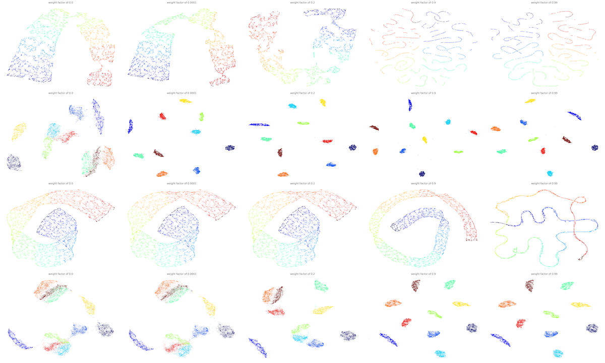

Supervised Learning
======================

This is another basic operation of CAMEL. We will use several examples below with code to illustrate how to use CAMEL to perform the supervised learning task.

Simple case
------------
One simple example template is available in the git_folder_structure under folder test (test_camel_supervised.py).

The first step is to import all nessary modulues, such as 

.. code-block:: python

    import matplotlib.pyplot as plt
    import time
    from camel import CAMEL
    from sklearn import datasets

The next step is to load the data. We also checked the time() function here to evaluae the speed of computing. In this simple example, we directly used the datasets from sklearn package, swiss_roll.

.. code-block:: python

    t1=time.time()
    X, y = datasets.make_swiss_roll(n_samples=50000, random_state=None)

Now, we load the feature data to variable X and label info to variable y. 50000 data are loaded. random_state is not fixed, so you will get slightly diffrent results every time you run this data loader.

Following this, we can define the CAMEL() class.

.. code:: python

    reducer= CAMEL(target_type='numerical') #as labels are numerical values 

Now, we define a simplest CAMEL() class, reducer. It should be mentioned that swiss_roll data labels is a contineuous variable and we chaange the target (e.g., labels) type to numerical. The default value for target_tytpe is categorical.

Next, we want to perform the unsupervised learning using the defined CAMEL() class. 

.. code:: python

    X_embedding = reducer.fit_transform(X, y)
    print(time.time()-t1)

It is seen that the diffrence between the unsupervised learning and supervised learning is that you includes "y" in the argument. 

.. code:: python

    y = y.astype(int) #convert to category for easy visulization
    # Visualization
    plt.figure(1)
    plt.scatter(X_embedding[:, 0], X_embedding[:, 1], c=y, cmap='jet', s=0.2)
    plt.title('CAMEL Embedding')
    plt.tight_layout()
    plt.show()

You will see the resulted embedding is somewhat similar to the unsupervised learning.

One critical parameter in the supervised learning is the weight coefficient of the label/target. weight_target is used to set this value. The default value is 0.5, which indicates the equal wieght for feature and label.

target_weight  approaches zero indicates the almost unsupervised learning. target_weight approaches 1 indicates that lable information will dominates (feature not important in the embedding).

For example, you want to change the weight_target to be 0.9. Thus,

.. code:: python

    X_embedding = reducer.fit_transform(X, y)
    print(time.time()-t1)
    y = y.astype(int)
    # Visualization
    plt.figure(1)
    plt.scatter(X_embedding[:, 0], X_embedding[:, 1], c=y, cmap='jet', s=0.2)
    plt.title('CAMEL Embedding')
    plt.tight_layout()
    plt.show()

It is noticed that the embedding is much more narrower than the unsupervised one because the feature space is less important and the label value donimates the final embedding structure. For extreme case (e.g., weight is 0.99), one can obatin

.. code:: python

    X_embedding = reducer.fit_transform(X, y)
    print(time.time()-t1)
    y = y.astype(int)
    # Visualization
    plt.figure(1)
    plt.scatter(X_embedding[:, 0], X_embedding[:, 1], c=y, cmap='jet', s=0.2)
    plt.title('CAMEL Embedding')
    plt.tight_layout()
    plt.show()

It is seen that the embedding is approaching a 1D rope as the label information is so dominant that the feature topology does not matters (degenerate to a single point on the rope for the same label value).

Comprehensive example
-----------------------

A more comprehensive exmaple is shown here, which is the template (supervised_learning_compare.py) under the folder demo in the git repo. Dpemneding on your stored location, the path in the code might need to be updated.

The first step is to import all nessary modulues and load data function is the same as the unsupervised learning and is not repeated here.

.. code:: python

    data_path = "../data/"
    output_path = "../output/supervised_learning/"
    methods_compare= ['UMAP','CAMEL']
    data_compare = ['swiss_roll', 'MNIST']
    weight_list = np.array([0.0, 1e-4, 0.2, 0.9, 0.99])

The above code specifies the data_path and output_path. If you downloaded the fit and directly work on the files in the /demo folder, then you do not need to change these paths as they are referring to the \data folder and \output folder in the parent directory.

The above code also specifies the methods checked and material database used. It also checks the effect of dirrent weight_coefficient for the supervised learning. Since only UMAP and CAMEL provide this functionality, only these two methods are checked.

.. code:: python

    n_monte=5

    n_methods=len(methods_compare)
    n_data=len(data_compare)
    n_weight=len(weight_list)

    metrics_knn=np.zeros([n_monte,n_data,n_methods])
    metrics_svm=np.zeros([n_monte,n_data,n_methods])
    metrics_triplet=np.zeros([n_monte,n_data,n_methods])
    metrics_nkr=np.zeros([n_monte,n_data,n_methods])
    metrics_scorr=np.zeros([n_monte,n_data,n_methods])
    metrics_cenknn=np.zeros([n_monte,n_data,n_methods])
    metrics_cencorr=np.zeros([n_monte,n_data,n_methods])
    metrics_clusterratio=np.zeros([n_monte,n_data,n_methods])
    metrics_coranking_auc=np.zeros([n_monte,n_data,n_methods])
    metrics_coranking_trust=np.zeros([n_monte,n_data,n_methods])
    metrics_coranking_cont=np.zeros([n_monte,n_data,n_methods])
    metrics_coranking_lcmc=np.zeros([n_monte,n_data,n_methods])
    metrics_curvature_simi=np.zeros([n_monte,n_data,n_methods])
    metrics_nnwr=np.zeros([n_monte,n_data,n_methods])

Since the embedding is random, the performance check may need multiple runs and n_monte is the number of Monte Carlo simulations. The code also zeros many matrices to store the metrics computiing.
metrics_XXXX referes to the computing of XXXX (name of metrics and can be found in the arXiv paper for details).

.. code:: python

    # Set up the grid
    fig = plt.figure(figsize=(8*n_weight,6*n_data*n_methods),layout='constrained',dpi=300)
    gs = GridSpec(n_data*n_methods, n_weight, figure=fig)

    digit_axes = np.zeros((n_data*n_methods, n_weight), dtype=object)

Since there are several methods and datasets, the visulization is orgnized using grid matlibplot. You can use this as the template for other type of grid plot.

.. code:: python

    for k in range(n_methods):
        
        # if methods_compare[k] == 'PaCMAP':
        #     transformer = pacmap.PaCMAP()
        # elif methods_compare[k]  == 'UMAP':
        #     transformer = umap.UMAP()
        # elif methods_compare[k] == 'TSNE':
        #     transformer = TSNE()
        # elif methods_compare[k]  == 'TriMAP':
        #     transformer = trimap.TRIMAP()
        # elif methods_compare[k]  == 'CAMEL':
        #     transformer = CAMEL(n_neighbors=10, FP_number=20, w_neighbors=1.0, 
        #                         tail_coe=0.05, w_curv=0.1, w_FP=20, num_iters=400, target_weight=weight_list[j], random_state=None)            
        # else:
        #     print("Incorrect method specified")
        #     assert(False)

        for i in range(n_data):
            X, y = data_prep(data_path, data_compare[i], size=10000)
            if len(set(y))>0.1*y.shape[0]:
                labels_contineous=True
                target_type='numerical'
                target_metric='l2'
            else:
                labels_contineous=False
                target_type='categorical'
                target_metric='categorical'
            for j in range(n_weight):
                
                
                if methods_compare[k] == 'PaCMAP':
                    transformer = pacmap.PaCMAP()
                elif methods_compare[k]  == 'UMAP':
                    transformer = umap.UMAP(target_metric=target_metric, target_weight=weight_list[j],random_state=1)
                    if weight_list[j] < 1e-8:
                        X_embedding = transformer.fit_transform(X)
                    else:
                        X_embedding = transformer.fit_transform(X, y)
    
                elif methods_compare[k] == 'TSNE':
                    transformer = TSNE()
                elif methods_compare[k]  == 'TriMAP':
                    transformer = trimap.TRIMAP()
                elif methods_compare[k]  == 'CAMEL':
                    transformer = CAMEL(n_neighbors=10, FP_number=20, w_neighbors=1.0, 
                                        tail_coe=0.05, w_curv=0.001, w_FP=20, num_iters=400, target_weight=weight_list[j], target_type=target_type, random_state=1)     
                    if weight_list[j] < 1e-8:
                        X_embedding = transformer.fit_transform(X)
                    else:
                        X_embedding = transformer.fit_transform(X, y)

                else:
                    print("Incorrect method specified")
                    assert(False)
            

                y_plot = np.copy(y).astype(int)
        
                # Visualization
                

                
                digit_axes[k*n_data+i, j] = fig.add_subplot(gs[k*n_data+i, j])
                digit_axes[k*n_data+i, j].scatter(X_embedding[:, 0], X_embedding[:, 1],
                                    c=y_plot, cmap='jet', s=0.2)
                title_embedding = 'weight factor of '+ str(weight_list[j])
                digit_axes[k*n_data+i, j].set_title(title_embedding,fontsize=12)
                digit_axes[k*n_data+i, j].set_axis_off()

The above code performs the computing by looping through methods, data, and different weight coefficients. 

Finally, all results are saved in the specified output path. Once all done, you can check the visulization of embedding results. As can be seen, the weight coeefficients have significant impact on the final embedding. 

The left most column is the unsupervised learning (weight = 0) and right most column is the supervised learning with weight =1.0. The transiion results are shown i nthe middle collumns. 

