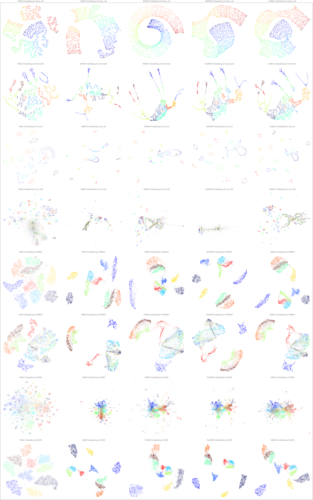

Unsupervised Learning
======================

This is the most basic operation of CAMEL. We will use several examples below with code to illustrate how to use CAMEL to perform the unsupervised learning task.

Simple case
------------
One simple example template is available in the git_folder_structure under folder test (test_camel_unsupervised.py).

The first step is to import all nessary modulues, such as 

.. code-block:: python

    import matplotlib.pyplot as plt
    import time
    from camel import CAMEL
    from sklearn import datasets

The next step is to load the data. We also checked the time() function here to evaluae the speed of computing. In this simple example, we directly used the datasets from sklearn package, swiss_roll.

.. code-block:: python

    t1=time.time()
    X, y = datasets.make_swiss_roll(n_samples=50000, random_state=None)

Now, we load the feature data to variable X and label info to variable y. 50000 data are loaded. random_state is not fixed, so you will get slightly diffrent results every time you run this data loader.

Following this, we can define the CAMEL() class.

.. code:: python

    reducer= CAMEL()

Now, we define a simplest CAMEL() class, reducer. We do not change any default setting in the CAMEL() class, as no new parameter settings are given.

Next, we want to perform the unsupervised learning using the defined CAMEL() class. 

.. code:: python

    X_embedding = reducer.fit_transform(X)
    print(time.time()-t1)

reducer.fit_transform is the operation to embed X to a low-diomentional sapce (default value is 2). Since the label information y is not provided, it only performs unsupervised learning. After the computing, it will output a time

.. code:: python

    6.261963129043579

It is very fast in this case as the input feature space is not high (e.g., 3). You now have a list of embedding of all in put data (e.g., X_embedding) and can evaluate how good this embedding is. We will show another example later for metrics-based evaluation. For now, we only focus on visual inspection.

.. code:: python

    # Visualization
    plt.figure(1)
    plt.scatter(X_embedding[:, 0], X_embedding[:, 1], c=y, cmap='jet', s=0.2)
    plt.title('CAMEL Embedding')
    plt.tight_layout()
    plt.show()

After running this code, you will see an embedding plot in 2D for the 3D swiss_roll data. 

.. image:: ../swiss_roll_unsupervised_contineous.png
  :width: 600
  :alt: swiss_roll_unsupervised
  :align: center

Sometimes, you have categorical data or you want categorical color scheme to see the trend. Thus, the labels can be converted to categorical data for visualization

.. code:: python

    y = y.astype(int) #convert to category for easy visulization
    # Visualization
    plt.figure(1)
    plt.scatter(X_embedding[:, 0], X_embedding[:, 1], c=y, cmap='jet', s=0.2)
    plt.title('CAMEL Embedding')
    plt.tight_layout()
    plt.show()

.. image:: ../swiss_roll_unsupervised.png
  :width: 600
  :alt: swiss_roll_unsupervised
  :align: center

You will see the color scheme is in discrete cases. It should be noted that the embedding shape has slight diffrence and it is because the embedding is random.

Above discussion is for the unsupervised learning with all default setting. If you want to change CAMEL() parameters, you can specify the parameters when you define the reducer. Detailed parameter setting can be found in the API section.

For example, you want to change the number of neighbors to be 20 and the weight coeffieict for curvature to be 0.01. Thus,

.. code:: python

    reducer= CAMEL(n_neighbors=20, w_curv=0.01)
    X_embedding = reducer.fit_transform(X)
    print(time.time()-t1)
    y = y.astype(int) #convert to category for easy visulization
    # Visualization
    plt.figure(1)
    plt.scatter(X_embedding[:, 0], X_embedding[:, 1], c=y, cmap='jet', s=0.2)
    plt.title('CAMEL Embedding')
    plt.tight_layout()
    plt.show()

.. image:: ../swiss_roll_unsupervised_parachange.png
  :width: 600
  :alt: swiss_roll_unsupervised_parachange
  :align: center

It is seen that the new plot shows diffrent embedding results. You can change other parameter settings following the same procedure. 

Comprehensive example
-----------------------

A more comprehensive exmaple is shown here, whic his the template (model_compare.py) under the folder demo in the git repo. Dpemneding on your stored location, the path in the code might need to be updated.

The first step is to import all nessary modulues, such as 

.. code:: python

    # need to install the following packages
    import umap
    import trimap
    import pacmap

    import json
    import numpy as np
    import pandas as pd
    import matplotlib.pyplot as plt
    from matplotlib.gridspec import GridSpec

    from camel import CAMEL
    from eval_metrics import *

    from time import time

    from sklearn.manifold import TSNE
    from sklearn.datasets import make_swiss_roll, make_s_curve

    global _RANDOM_STATE
    _RANDOM_STATE = None

It should be mentioned that the above code also imported other methods for comparision, such as umap, trimap, pacmap, and TSNE. This assumes that you already installed them. If not, please follow their git repo to install first.

It is also assumes that you put the file eval_metrics.py in the same folder as your current Python file. This modulue is for the metrics-based evaluation for your embedding results.

.. code:: python

    def data_prep(data_path, dataset='MNIST', size=10000):
    '''
    This function loads the dataset as numpy array.
    Input:
        data_path: path of the folder you store all the data needed.
        dataset: the name of the dataset.
        size: the size of the dataset. This is useful when you only
              want to pick a subset of the data
    Output:
        X: the dataset in numpy array
        labels: the labels of the dataset.
    '''

    if dataset == 'MNIST':
        X = np.load(data_path + '/mnist_images.npy', allow_pickle=True).reshape(70000, 28*28)
        labels = np.load(data_path + '/mnist_labels.npy', allow_pickle=True)
    elif dataset == 'FMNIST':
        X = np.load(data_path + '/fmnist_images.npy', allow_pickle=True).reshape(70000, 28*28)
        labels = np.load(data_path + '/fmnist_labels.npy', allow_pickle=True)
    ........
    else:
        print('Unsupported dataset')
        assert(False)
    return X[:size], labels[:size]

The above code is a function for arbitrary data loader from your local drive. You need to specify the data_path and the function will load .npy, .json. amd .csv files. You can use this function as a template for your own datasets.

.. code:: python

    data_path = "../data/"
    output_path = "../output/"
    methods_compare= ['TSNE', 'UMAP', 'TriMAP', 'PaCMAP', 'CAMEL']
    data_compare = ['swiss_roll', 'mammoth', 'coil_20', 'coil_100','MNIST', 'FMNIST', '20NG', 'USPS']

The above code specifies the data_path and output_path. If you downloaded the fit and directly work on the files i nthe /demo folder, then you do not need to change these paths as they are referring to the \data folder and \output folder in the parent directory.

The above code also specifies the methods checked and material database used. This is helpful if you have multiple data and methods to check.

.. code:: python

    n_monte=10
    n_methods=len(methods_compare)
    n_data=len(data_compare)
    total_time=np.zeros([n_monte,n_data,n_methods])
    metrics_knn=np.zeros([n_monte,n_data,n_methods])
    metrics_svm=np.zeros([n_monte,n_data,n_methods])
    metrics_triplet=np.zeros([n_monte,n_data,n_methods])
    metrics_nkr=np.zeros([n_monte,n_data,n_methods])
    metrics_scorr=np.zeros([n_monte,n_data,n_methods])
    metrics_cenknn=np.zeros([n_monte,n_data,n_methods])
    metrics_cencorr=np.zeros([n_monte,n_data,n_methods])
    metrics_clusterratio=np.zeros([n_monte,n_data,n_methods])
    metrics_coranking_auc=np.zeros([n_monte,n_data,n_methods])
    metrics_coranking_trust=np.zeros([n_monte,n_data,n_methods])
    metrics_coranking_cont=np.zeros([n_monte,n_data,n_methods])
    metrics_coranking_lcmc=np.zeros([n_monte,n_data,n_methods])
    metrics_curvature_simi=np.zeros([n_monte,n_data,n_methods])
    metrics_nnwr=np.zeros([n_monte,n_data,n_methods])

Since the embedding is random, the performance check may need multiple runs and n_monte is the number of Monte Carlo simulations. The code also zeros many matrices to store the metrics computiing.
metrics_XXXX referes to the computing of XXXX (name of metrics and can be found in the arXiv paper for details).

.. code:: python

    # Set up the grid
    fig = plt.figure(figsize=(6*n_methods,6*n_data),layout='constrained',dpi=300)
    gs = GridSpec(n_data, n_methods, figure=fig)
    scatter_ax = fig.add_subplot(gs[:, :])
    digit_axes = np.zeros((n_data, n_methods), dtype=object)
    scatter_ax.set(xticks=[], yticks=[])

Since there are several methods and datasets, the visulization is orgnized using grid matlibplot. You can use this as the template for other type of grid plot.

.. code:: python

    for k in range(n_monte):

        for i in range(n_data):
            X, y = data_prep(data_path, data_compare[i], size=10000)
            if len(set(y))>0.1*y.shape[0]:
                labels_contineous=True
            else:
                labels_contineous=False
            for j in range(n_methods):
            
                if methods_compare[j] == 'PaCMAP':
                    transformer = pacmap.PaCMAP()
                elif methods_compare[j]  == 'UMAP':
                    transformer = umap.UMAP()
                elif methods_compare[j] == 'TSNE':
                    transformer = TSNE()
                elif methods_compare[j]  == 'TriMAP':
                    transformer = trimap.TRIMAP()
                elif methods_compare[j]  == 'CAMEL':
                    transformer = CAMEL(n_neighbors=10, FP_number=20, w_neighbors=1.0, 
                                        tail_coe=0.05, w_curv=0.001, w_FP=20, num_iters=400, random_state=None)            
                else:
                    print("Incorrect method specified")
                    assert(False)
                start_time = time()
            X_embedding = transformer.fit_transform(X)
            total_time [k,i,j] = time() - start_time
    
            y = y.astype(int)
    
            # Visualization
            
            if k == 0:
            
                digit_axes[i, j] = fig.add_subplot(gs[i, j])
                digit_axes[i, j].scatter(X_embedding[:, 0], X_embedding[:, 1],
                                    c=y, cmap='jet', s=0.2)
                title_embedding = methods_compare[j] +' ' +'Embedding of '+ data_compare[i]
                digit_axes[i, j].set_title(title_embedding,fontsize=12)
                digit_axes[i, j].set_axis_off()
            
            # plt.show()
    
            
            
            #metrics-based evaluation
            #1. knn_eval_large
            metrics_knn[k,i,j] = knn_eval_large(X_embedding, y)
            #2. metrics_svm
            metrics_svm[k,i, j] = svm_eval_large(X_embedding, y)
            #3. random triplet eval
            metrics_triplet[k,i,j] = random_triplet_eval(X, X_embedding)
            #4. neighbor kept ratio nkr  - has issues
            metrics_nkr[k,i,j] = neighbor_kept_ratio_eval(X, X_embedding)
            #5. spearman correaltion
            metrics_scorr[k,i,j] = spearman_correlation_eval(X, X_embedding)
            # #6. centroid knn 
            metrics_cenknn[k,i,j] = centroid_knn_eval(X, X_embedding, y)
            #centroid dist corr
            metrics_cencorr[k,i,j] = centroid_corr_eval(X, X_embedding, y)
            #cluster ratio
            metrics_clusterratio[k,i,j] = cluster_ratio_eval1(X, X_embedding, y, labels_contineous)
            # coranking auc 
            # metrics_coranking_auc[k,i,j], metrics_coranking_trust[k,i,j],
            # metrics_coranking_cont[k,i,j], metrics_coranking_lcmc[k,i,j]= coranking_auc_eval(X, X_embedding)
            coranking_auc,coranking_trust,conranking_cont,conranking_lcmc = coranking_auc_eval(X, X_embedding)
            metrics_coranking_auc[k,i,j]=coranking_auc
            metrics_coranking_trust[k,i,j]=coranking_trust
            metrics_coranking_cont[k,i,j]=conranking_cont
            metrics_coranking_lcmc[k,i,j]=conranking_lcmc
            # # curvature correlation 
            metrics_curvature_simi[k,i,j] = curvature_simi_eval(X, X_embedding)
            # neighbor not wrong ratio
            metrics_nnwr[k,i,j] = neighbor_notwrong_ratio_eval(X, X_embedding)

The above code performs the computing by looping through methods, data, and Monte Carlo simulations. Since all methods have similar calling format, the similar format is used to define the transformer.

Once done, one Monte Carlo simulation result is visulized bt the grid plot of all emebedding results.

All metrics are also computed by the imported function from eval_metrics.py. It should be noted that these metrics computation can be very expensive depending on particular ones. Use them carefully if you have a large datasets.

To provide a reference, the 5 MC for the above checking will need 10-12 hours on a MacBook Air M2 with 16 GB mem. The embedding itself only takes a few minutes.

.. code:: python

    #save all results in output folder        
    np.save(output_path + '/total_time.npy', total_time)
    np.save(output_path + '/metrics_knn.npy', metrics_knn)
    np.save(output_path + '/metrics_svm.npy', metrics_svm)
    np.save(output_path + '/metrics_triplet.npy', metrics_triplet)
    np.save(output_path + '/metrics_nkr.npy', metrics_nkr)
    np.save(output_path + '/metrics_scorr.npy', metrics_scorr)
    np.save(output_path + '/metrics_cenknn.npy', metrics_cenknn)
    np.save(output_path + '/metrics_cencorr.npy', metrics_cencorr)
    np.save(output_path + '/metrics_clusterratio', metrics_clusterratio)
    np.save(output_path + '/metrics_coranking_auc', metrics_coranking_auc)
    np.save(output_path + '/metrics_coranking_trust', metrics_coranking_trust)
    np.save(output_path + '/metrics_coranking_cont', metrics_coranking_cont)
    np.save(output_path + '/metrics_coranking_lcmc', metrics_coranking_lcmc)
    np.save(output_path + '/metrics_curvature_simi', metrics_curvature_simi)
    np.save(output_path + '/metrics_nnwr', metrics_nnwr)
    np.save(output_path + '/methods_compare.npy', methods_compare)
    np.save(output_path + '/data_compare.npy', data_compare)

    plt.savefig(output_path +'model_compare.png')
            
    print(total_time)   

Finally, all results are saved in the specified output path. This is helpful when you want to revisit the results in the future. Or, you need to visulize the metrics results. Please refer to plotting tutorial for details.

Once all done, you can check the visulization of embedding results.

