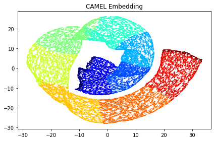

Unsupervised Learning
======================

This is the most basic operation of CAMEL. We will use several examples below with code to illustrate how to use CAMEL to perform the unsupervised learning task.

Simple case
------------
One simple example template is available in the git_folder_structure under folder test (unsupervised_learning.py).

The first step is to import all nessary modulues, such as 

.. code-block:: python
    import matplotlib.pyplot as plt
    import time
    from camel import CAMEL
    from sklearn import datasets

The next step is to load the data. We also checked the time() function here to evaluae the speed of computing. In this simple example, we directly used the datasets from sklearn package, swiss_roll.

.. code:: python
    t1=time.time()
    X, y = datasets.make_swiss_roll(n_samples=50000, random_state=None)

Now, we load the feature data to variable X and label info to variable y. 50000 data are loaded. random_state is not fixed, so you will get slightly diffrent results every time you run this data loader.

Following this, we can define the CAMEL() class.

.. code:: python
    reducer= CAMEL()

Now, we define a simplest CAMEL() class, reducer. We do not change any default setting in the CAMEL() class, as no new parameter settings are given.

Next, we want to perform the unsupervised learning using the defined CAMEL() class. 

.. code:: python
    X_embedding = reducer.fit_transform(X)
    print(time.time()-t1)

reducer.fit_transform is the operation to embed X to a low-diomentional sapce (default value is 2). Since the label information y is not provided, it only performs unsupervised learning. After the computing, it will output a time

.. code:: python
    6.261963129043579

It is very fast in this case as the input feature space is not high (e.g., 3). You now have a list of embedding of all in put data (e.g., X_embedding) and can evaluate how good this embedding is. We will show another example later for metrics-based evaluation. For now, we only focus on visual inspection.

.. code:: python
    # Visualization
    plt.figure(1)
    plt.scatter(X_embedding[:, 0], X_embedding[:, 1], c=y, cmap='jet', s=0.2)
    plt.title('CAMEL Embedding')
    plt.tight_layout()
    plt.show()

After running this code, you will see an embedding plot in 2D for the 3D swiss_roll data. 

.. image:: ../swiss_roll_unsupervised_contineous.png
  :width: 600
  :alt: swiss_roll_unsupervised
  :align: center

Sometimes, you have categorical data or you want categorical color scheme to see the trend. Thus, the labels can be converted to categorical data for visualization

.. code:: python
    y = y.astype(int) #convert to category for easy visulization
    # Visualization
    plt.figure(1)
    plt.scatter(X_embedding[:, 0], X_embedding[:, 1], c=y, cmap='jet', s=0.2)
    plt.title('CAMEL Embedding')
    plt.tight_layout()
    plt.show()

You will see the color scheme is in discrete cases. It should be noted that the embedding shape has slight diffrence and it is because the embedding is random.

Above discussion is for the unsupervised learning with all default setting. If you want to change CAMEL() parameters, you can specify the parameters when you define the reducer. Detailed parameter setting can be found in the API section.

For example, you want to change the number of neighbors to be 20 and the weight coeffieict for curvature to be 0.01. Thus,

.. code:: python
    reducer= CAMEL(n_neighbors=20, w_curv=0.01)
    X_embedding = reducer.fit_transform(X)
    print(time.time()-t1)
    y = y.astype(int) #convert to category for easy visulization
    # Visualization
    plt.figure(1)
    plt.scatter(X_embedding[:, 0], X_embedding[:, 1], c=y, cmap='jet', s=0.2)
    plt.title('CAMEL Embedding')
    plt.tight_layout()
    plt.show()

.. image:: ../swiss_roll_unsupervised_parachange.png
  :width: 600
  :alt: swiss_roll_unsupervised_parachange
  :align: center

It is seen that the new plot shows diffrent embedding results. You can change other parameter settings following the same procedure. 

Comprehensive example
-----------------------

A more comprehensive exmaple is shown here, whic his the template (model_compare.py) under the folder demo in the git repo. Dpemneding on your stored location, the path in the code might need to be updated.

The first step is to import all nessary modulues, such as 

.. code:: python
    # need to install the following packages
    import umap
    import trimap
    import pacmap

    import json
    import numpy as np
    import pandas as pd
    import matplotlib.pyplot as plt
    from matplotlib.gridspec import GridSpec

    from camel import CAMEL
    from eval_metrics import *

    from time import time

    from sklearn.manifold import TSNE
    from sklearn.datasets import make_swiss_roll, make_s_curve

    global _RANDOM_STATE
    _RANDOM_STATE = None

It should be mentioned that the above code also imported other methods for comparision, such as umap, trimap, pacmap, and TSNE. This assumes that you already installed them. If not, please follow their git repo to install first.

It is also assumes that you put the file eval_metrics.py in the same folder as your current Python file. This modulue is for the metrics-based evaluation for your embedding results.

